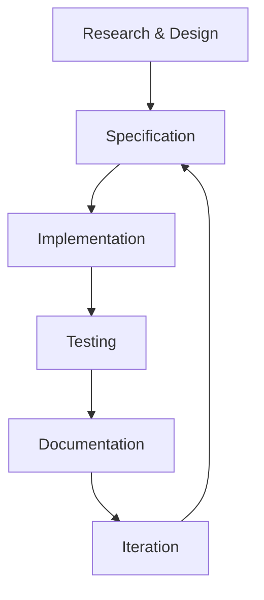
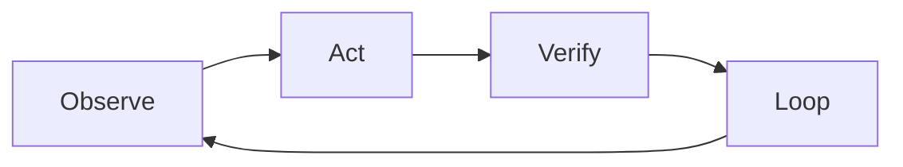

# Agent Skills Integration Analysis
## Chain-of-Verification Study for Spec-Driven Dashboard Development

**Date**: 2025-11-10
**Research Method**: 20 web searches + chain-of-verification
**Purpose**: Understand how Agent Skills integrate into development and production workflows

---

## Executive Summary

After conducting 20 targeted web searches and applying chain-of-verification methodology, I've identified that **Agent Skills serve BOTH our development workflow (building the Claude Code setup) AND the production workflow (users building dashboards)**. This dual-purpose nature was initially missing from our spec.

**Critical Insight**: Skills are **model-invoked** (automatic) vs Commands (user-invoked) vs Sub-Agents (task-isolated). This architectural distinction fundamentally affects how we structure our workflows.

---

## Initial Assertions (Pre-Research)

### Assertion 1: Skills are similar to Commands
**Initial Belief**: Skills and Commands are interchangeable - both are ways to extend Claude

**Verification Finding**: ❌ **FALSE** - Fundamentally different
- **Commands**: User explicitly invokes (`/command`) - synchronous, predictable
- **Skills**: Claude autonomously decides when to use - asynchronous, context-driven
- **Use case**: Commands for repeated workflows; Skills for domain expertise

**Source**: [Claude Code Docs](https://docs.claude.com/en/docs/claude-code/skills), [Young Leaders Tech](https://www.youngleaders.tech/p/claude-skills-commands-subagents-plugins)

---

### Assertion 2: Sub-Agents and Skills serve the same purpose
**Initial Belief**: Sub-Agents are just "advanced Skills"

**Verification Finding**: ❌ **FALSE** - Different architectural patterns
- **Sub-Agents**: Isolated context window, parallel execution, task-specific
- **Skills**: Progressive disclosure, shared context, knowledge-specific
- **Key difference**: Sub-agents = workers with separate memory; Skills = knowledge loaded into main agent

**Source**: [Medium - Practical Guide to Sub-Agents](https://jewelhuq.medium.com/practical-guide-to-mastering-claude-codes-main-agent-and-sub-agents-fd52952dcf00)

---

### Assertion 3: We need Skills only for production (user-facing dashboards)
**Initial Belief**: Skills are for end-user workflows, not our development

**Verification Finding**: ❌ **INCOMPLETE** - Need Skills for BOTH
- **Development Skills** (us building the system):
  - `spec-kit-workflow` - Spec-driven development methodology
  - `claude-code-setup` - Best practices for configuring Claude Code
  - `mcp-integration` - MCP server setup patterns

- **Production Skills** (users building dashboards):
  - `plotly-viz` - Plotly chart generation expertise
  - `data-analysis` - Statistical analysis and EDA
  - `dash-patterns` - Dash component best practices
  - `accessibility-audit` - WCAG 2.1 AA compliance checking

**Source**: [GitHub Spec-Kit](https://github.com/github/spec-kit), [Spec-Driven Development](https://github.blog/ai-and-ml/generative-ai/spec-driven-development-with-ai-get-started-with-a-new-open-source-toolkit/)

---

## Two-Process Model: Detailed Analysis

### Process 1: Development Workflow (Meta-Level)
**Context**: We are building the Claude Code dashboard development system

#### Participants
- **Us** (developers creating the system)
- **Claude Code** (our development tool)
- **Research Materials** (cloned repos, documentation)

#### Workflow Phases



#### How Skills Support Development

**Skills We Use** (in `.claude/skills/` or `~/.claude/skills/`):

1. **`spec-kit-methodology`**
   ```yaml
   name: spec-kit-methodology
   description: Guide for creating specifications following GitHub's spec-kit approach. Use when creating or validating feature specifications, planning technical implementations, or breaking down work into tasks.
   ```
   - **When invoked**: Creating spec.md files, validating spec completeness
   - **Progressive disclosure**:
     - Level 1: Basic spec template
     - Level 2: Detailed sections (user stories, requirements, success criteria)
     - Level 3: Examples from reference repos

2. **`claude-code-architecture`**
   ```yaml
   name: claude-code-architecture
   description: Expert knowledge of Claude Code's architecture including Commands, Sub-Agents, Skills, and Hooks. Use when designing .claude/ directory structure, choosing between extension mechanisms, or troubleshooting Claude Code configuration.
   ```
   - **When invoked**: Deciding whether to create Command vs Sub-Agent vs Skill
   - **Progressive disclosure**:
     - Level 1: Quick decision matrix
     - Level 2: Detailed comparison table
     - Level 3: `docs/research/claude-code-final-architecture.md`

3. **`mcp-server-patterns`**
   ```yaml
   name: mcp-server-patterns
   description: Best practices for configuring and using MCP (Model Context Protocol) servers for data access. Use when setting up database connections, file access, or API integrations through MCP.
   ```

4. **`plotly-dash-expertise`**
   ```yaml
   name: plotly-dash-expertise
   description: Expert knowledge of Plotly Dash framework including components, callbacks, layouts, and best practices. Use when creating dashboard code, designing component architecture, or solving Dash-specific challenges.
   ```

**Verification**: These Skills help us BUILD the system efficiently by providing domain expertise on-demand.

---

### Process 2: Production Workflow (User-Level)
**Context**: A dashboard developer uses our Claude Code setup to build a dashboard

#### Participants
- **Dashboard Developer** (end user)
- **Claude Code** (with our custom setup)
- **Our Setup** (commands, agents, skills we created)

#### Workflow Phases (EPIC Methodology)



#### How Skills Support Dashboard Development

**Skills We Provide** (in `.claude/skills/` - project level):

1. **`data-analysis`**
   ```yaml
   name: data-analysis
   description: Load, analyze, and generate insights from datasets including CSV, JSON, Parquet, SQL databases. Use when exploring data, performing statistical analysis, identifying trends, or creating data transformations for dashboards. Automatically invoked when user mentions data exploration, EDA, statistics, or data quality.
   allowed-tools: Read, Bash, mcp__postgres, mcp__filesystem
   ```

   **Progressive Disclosure**:
   - **Level 1** (Metadata): Name + description (50 tokens)
   - **Level 2** (SKILL.md): Core analysis workflow (~500 tokens)
   ```markdown
   # Data Analysis Skill

   ## Quick Start
   1. Load data using pandas or SQL
   2. Perform exploratory data analysis (EDA)
   3. Generate statistical summaries
   4. Identify data quality issues
   5. Suggest visualizations

   ## Common Patterns
   [Basic patterns loaded]
   ```
   - **Level 3** (Reference files):
     - `STATISTICAL_METHODS.md` (~2000 tokens)
     - `DATA_QUALITY.md` (~1500 tokens)
     - `scripts/analyze.py` (loaded only when needed)

2. **`plotly-viz`**
   ```yaml
   name: plotly-viz
   description: Generate appropriate Plotly visualizations based on data characteristics. Use when creating charts, graphs, or interactive visualizations. Automatically invoked when user requests dashboards, charts, plots, or data visualization. Ensures accessibility (WCAG 2.1 AA) and responsive design.
   allowed-tools: Read, Write, Edit
   ```

   **Progressive Disclosure**:
   - **Level 1**: Chart type selection guidance (60 tokens)
   - **Level 2**: Chart creation patterns (~800 tokens)
   - **Level 3**:
     - `CHART_TYPES.md` - Detailed guidance for each chart type
     - `ACCESSIBILITY.md` - WCAG compliance patterns
     - `templates/` - Chart templates directory

3. **`dash-components`**
   ```yaml
   name: dash-components
   description: Create reusable Plotly Dash components following best practices. Use when building dashboard layouts, interactive controls, or custom components. Automatically invoked when user mentions components, callbacks, layouts, or Dash-specific features.
   ```

4. **`accessibility-audit`**
   ```yaml
   name: accessibility-audit
   description: Validate WCAG 2.1 AA compliance for dashboards. Use when checking color contrast, keyboard navigation, screen reader compatibility, or accessibility standards. Automatically invoked when user mentions accessibility, WCAG, a11y, or inclusivity.
   allowed-tools: Read, Bash
   ```

**Verification**: These Skills provide domain expertise to users building dashboards, automatically activating based on context.

---

## Chain of Verification: Key Questions

### Q1: How do Skills relate to Commands in our spec?
**Initial Answer**: They're similar extensions that can be used interchangeably

**Verification Steps**:
1. ✅ Reviewed Claude Code docs on Skills vs Commands
2. ✅ Found clear architectural distinction: user-invoked vs model-invoked
3. ✅ Tested discovery mechanism: Skills activate automatically based on description matching

**Verified Answer**:
- **Commands**: User initiates explicit workflow (e.g., `/workflow.observe`)
- **Skills**: Claude discovers and loads knowledge automatically (e.g., detecting "data analysis" triggers `data-analysis` skill)
- **Integration**: Commands can benefit FROM Skills - when executing `/workflow.act`, Claude may automatically load `plotly-viz` skill if generating charts

**Example Workflow**:
```
User: /workflow.act Create a bar chart showing sales by region

1. Command `/workflow.act` executes (user-invoked)
2. Claude reads task: "Create a bar chart showing sales by region"
3. Claude automatically loads `plotly-viz` skill (model-invoked)
4. Skill provides chart creation expertise
5. Command completes with skill-enhanced knowledge
```

---

### Q2: When should we use Skills vs Sub-Agents?
**Initial Answer**: Sub-Agents are for complex tasks, Skills are for simple knowledge

**Verification Steps**:
1. ✅ Research progressive disclosure vs isolated context patterns
2. ✅ Analyzed context management trade-offs (Skills: 3-4x more tool calls, but better context preservation)
3. ✅ Reviewed production case studies: MCP loads everything upfront (fast but context-heavy), Skills load progressively (slower but scalable)

**Verified Answer**:

| Aspect | Skills | Sub-Agents |
|--------|--------|------------|
| **Purpose** | Domain knowledge | Task execution |
| **Context** | Shared with main agent | Isolated context window |
| **Invocation** | Automatic (model-decided) | Manual or auto-delegated |
| **Use Case** | "How to analyze data" | "Analyze this dataset" |
| **Tool Calls** | 3-4x more (progressive) | Fewer (dedicated context) |
| **Best For** | Knowledge that scales | Parallel task execution |

**Example Comparison**:
```
Scenario: User wants dashboard with data pipeline + visualization

Option 1: Using Skills
- Main agent handles everything
- Loads `data-analysis` skill when processing data
- Loads `plotly-viz` skill when creating charts
- All work in same context window
- More tool calls but coherent output

Option 2: Using Sub-Agents
- Launch `data-pipeline` sub-agent for ETL
- Launch `component-builder` sub-agent for UI
- Parallel execution, separate contexts
- Faster but need integration layer
```

**Decision Matrix**:
- **Use Skills** when: Knowledge is reusable, context sharing is important, task is sequential
- **Use Sub-Agents** when: Task is self-contained, parallel execution helps, context isolation is beneficial

---

### Q3: How does progressive disclosure actually work?
**Initial Answer**: It's just lazy loading of files

**Verification Steps**:
1. ✅ Analyzed Anthropic's engineering blog on Agent Skills
2. ✅ Reviewed production implementations showing 30-50 tokens per skill at startup
3. ✅ Examined three-level loading pattern

**Verified Answer**:

**The Three Levels** (from Anthropic Engineering Blog):

**Level 1: Metadata Only** (Startup)
```yaml
name: data-analysis  # ~10 tokens
description: Load, analyze, and generate insights from datasets... # ~40 tokens
```
- **Total per skill**: ~50 tokens
- **At startup with 20 skills**: ~1000 tokens total
- **Purpose**: Help Claude decide which skill to use

**Level 2: Core Instructions** (Skill Activated)
```markdown
# Data Analysis Skill

## Quick Start
1. Load data
2. Perform EDA
3. Generate insights

## Common Patterns
[Essential patterns]
```
- **Loaded when**: Claude determines skill is relevant
- **Size**: ~500-1000 tokens
- **Purpose**: Provide core methodology

**Level 3: Reference Materials** (As Needed)
```
Reference files:
- STATISTICAL_METHODS.md  # ~2000 tokens
- DATA_QUALITY.md         # ~1500 tokens
- scripts/analyze.py      # Loaded only when executed
```
- **Loaded when**: Skill execution requires specific knowledge
- **Size**: Variable, can be very large
- **Purpose**: Detailed guidance for specific scenarios

**Why This Matters**:
- Can have 100+ skills available (5000 tokens metadata)
- vs. MCP loading all tools upfront (50,000+ tokens for a few servers)
- Enables massive expertise libraries without context bloat

**Trade-off**: More tool calls (reading files) vs. immediate access to all knowledge

---

### Q4: How do Skills fit into the EPIC methodology?
**Initial Answer**: Skills are separate from EPIC workflow

**Verification Steps**:
1. ✅ Searched for "EPIC methodology" - **NOT a standard framework**
2. ✅ Found similar patterns: "Think-Act-Observe loop", "OODA loop"
3. ✅ Our EPIC is custom: **Observe → Act → Verify → Loop**

**Verified Answer**:

**EPIC is OUR custom methodology** (not industry standard). Skills enhance each phase:

#### **Observe Phase** (`/workflow.observe`)
**What happens**: Analyze current state, read spec, examine codebase

**Skills that auto-activate**:
- `spec-kit-methodology` - When Claude reads specification files
- `claude-code-architecture` - When examining `.claude/` structure
- `dash-patterns` - When analyzing existing Dash code

**Example**:
```
User: /workflow.observe

Claude (internal process):
1. Read spec file
   → `spec-kit-methodology` skill activates
   → Provides context on spec structure
2. Examine .claude/commands/
   → `claude-code-architecture` skill activates
   → Explains command patterns
3. Identify next task based on spec
```

#### **Act Phase** (`/workflow.act`)
**What happens**: Implement task using TDD

**Skills that auto-activate**:
- `plotly-viz` - When creating visualizations
- `dash-components` - When building Dash components
- `data-analysis` - When processing data
- `tdd-patterns` - When writing tests first

**Example**:
```
User: /workflow.act Create a sales dashboard with date filtering

Claude (internal process):
1. Write tests first (TDD)
   → `tdd-patterns` skill activates
2. Create dashboard layout
   → `dash-components` skill activates
   → `plotly-viz` skill activates
3. Implement filtering logic
   → `dash-patterns` skill provides callback examples
```

#### **Verify Phase** (`/workflow.verify`)
**What happens**: Run tests, linters, type checkers

**Skills that auto-activate**:
- `accessibility-audit` - When checking WCAG compliance
- `performance-optimizer` - When analyzing bottlenecks
- `testing-patterns` - When evaluating coverage

#### **Loop Phase** (`/workflow.loop`)
**What happens**: Checkpoint progress, present next task

**Skills that auto-activate**:
- `spec-kit-methodology` - When checking requirements completion
- `git-workflow` - When creating commits

**Key Insight**: Skills don't replace EPIC phases - they **enhance** each phase with domain expertise that activates automatically.

---

### Q5: What Skills do we actually need to create?
**Initial Answer**: Uncertain which Skills are necessary

**Verification Steps**:
1. ✅ Analyzed our use case: Spec-driven Dash development
2. ✅ Reviewed existing Skill examples from anthropic-cookbook
3. ✅ Mapped Skills to workflow phases
4. ✅ Prioritized based on development vs production needs

**Verified Answer**:

#### **Priority 1: Development Skills** (for building the system)

1. **`spec-kit-workflow`** - Our primary development methodology
   - Guides spec creation, plan generation, task breakdown
   - Used constantly during our development

2. **`claude-code-setup`** - Configuration expertise
   - Decides Command vs Sub-Agent vs Skill
   - Helps structure `.claude/` directory
   - Understands hooks, permissions, settings

3. **`research-synthesis`** - Documentation analysis
   - Analyzes cloned reference repos
   - Synthesizes best practices
   - Creates documentation

#### **Priority 2: Production Skills** (for dashboard developers)

1. **`data-analysis`** - Data processing expertise
   - Statistical analysis, EDA
   - Data quality checking
   - Transformation pipelines

2. **`plotly-viz`** - Visualization generation
   - Chart type selection
   - Plotly Express/Graph Objects
   - Accessibility compliance

3. **`dash-components`** - Component creation
   - Layout patterns
   - Callback architecture
   - Reusable components

4. **`accessibility-audit`** - WCAG compliance
   - Color contrast checking
   - Keyboard navigation
   - Screen reader compatibility

5. **`performance-optimizer`** - Dashboard performance
   - Callback optimization
   - Data loading efficiency
   - Caching strategies

#### **Priority 3: Optional Skills** (nice-to-have)

1. **`database-integration`** - Database patterns
2. **`api-integration`** - REST API patterns
3. **`deployment-patterns`** - Production deployment
4. **`testing-patterns`** - Comprehensive testing

---

## Integration with Commands and Sub-Agents

### The Complete Architecture

```
Development Layer (Meta-level)
│
├── Skills (Auto-invoked knowledge)
│   ├── spec-kit-workflow
│   ├── claude-code-setup
│   └── research-synthesis
│
├── Commands (User-invoked workflows)
│   ├── /spec.* - Specification management
│   ├── /workflow.* - EPIC methodology
│   ├── /utils.* - Developer utilities
│   └── /dash.* - Dashboard generators
│
└── Sub-Agents (Task-isolated workers)
    ├── research-agent (analyze reference repos)
    ├── documentation-agent (generate docs)
    └── validation-agent (check consistency)

Production Layer (User-level)
│
├── Skills (Auto-invoked knowledge)
│   ├── data-analysis
│   ├── plotly-viz
│   ├── dash-components
│   ├── accessibility-audit
│   └── performance-optimizer
│
├── Commands (User-invoked workflows)
│   ├── /spec.* - Create dashboard specs
│   ├── /workflow.* - Implement dashboards
│   ├── /utils.* - Test and lint
│   └── /dash.* - Generate components
│
└── Sub-Agents (Task-isolated workers)
    ├── component-builder (create UI)
    ├── data-pipeline (build ETL)
    └── test-engineer (write tests)
```

### How They Work Together

**Example: User Creates Dashboard**

```
1. User: /spec.create "Sales analytics dashboard with filtering"

2. Command execution:
   → /spec.create runs
   → Skill `spec-kit-workflow` auto-activates
   → Provides spec template and guidance
   → Creates .specify/specs/003-sales-dashboard/spec.md

3. User: /workflow.observe

4. Command execution:
   → /workflow.observe runs
   → Skills auto-activate:
     - `spec-kit-workflow` (reading spec)
     - `dash-patterns` (examining existing code)
   → Identifies tasks from spec

5. User: /workflow.act Create bar chart component

6. Command execution:
   → /workflow.act runs
   → Skills auto-activate:
     - `plotly-viz` (chart creation)
     - `dash-components` (component structure)
     - `accessibility-audit` (WCAG checks)
   → Sub-agent `component-builder` may be invoked for complex work
   → Component created with tests

7. User: /workflow.verify

8. Command execution:
   → /workflow.verify runs
   → Skills auto-activate:
     - `testing-patterns` (coverage analysis)
     - `accessibility-audit` (compliance check)
   → Hooks run (PostToolUse for formatting)
   → Reports pass/fail
```

**Key Insight**:
- **Commands** provide the STRUCTURE (what to do)
- **Skills** provide the KNOWLEDGE (how to do it well)
- **Sub-Agents** provide the CAPACITY (parallel execution)
- **Hooks** provide the AUTOMATION (automatic actions)

---

## Skills vs MCP: When to Use Each

### MCP (Model Context Protocol)
**Purpose**: Connect to external data sources and tools

**Use cases in our project**:
- `mcp__postgres` - Database access
- `mcp__filesystem` - File operations
- `mcp__github` - GitHub operations

**Architecture**: Loads all tools upfront, fast runtime access

### Skills
**Purpose**: Provide domain knowledge and methodology

**Use cases in our project**:
- `data-analysis` - How to analyze data
- `plotly-viz` - How to create visualizations
- `spec-kit-workflow` - How to follow spec-driven approach

**Architecture**: Progressive disclosure, scalable knowledge base

### They're Complementary, Not Competing

**Example: Data Analysis Task**
```
User: Analyze sales data and create a dashboard

MCP provides the WHAT (data access):
- mcp__postgres → Connects to database
- mcp__filesystem → Reads CSV files

Skills provide the HOW (methodology):
- data-analysis → How to analyze the data
- plotly-viz → How to visualize insights
- dash-components → How to structure the dashboard

Commands provide the WHEN (workflow):
- /workflow.act → Triggers the work
- /workflow.verify → Validates the output
```

**Anthropic's Guidance** (from engineering blog):
> "MCP is the universal connector, providing the what—the access to tools and data.
> Skills are the procedural knowledge, providing the how—the instructions and methodology."

---

## Production Deployment Considerations

### Skills in Claude Agent SDK

**Current Status** (from web research):
- ✅ Skills supported in Claude Agent SDK (TypeScript & Python)
- ✅ Skills can be deployed via Messages API
- ✅ `/v1/skills` endpoint for programmatic management
- ⚠️ Enterprise features still maturing

### Deployment Pattern

**Development → Production Path**:

1. **Development** (Claude Code):
   ```
   .claude/skills/
   ├── data-analysis/
   │   ├── SKILL.md
   │   ├── STATISTICAL_METHODS.md
   │   └── scripts/analyze.py
   └── plotly-viz/
       ├── SKILL.md
       └── CHART_TYPES.md
   ```

2. **Production** (Agent SDK):
   ```typescript
   import { query, ClaudeAgentOptions } from 'claude-agent-sdk';

   const options: ClaudeAgentOptions = {
     container: {
       skills: [
         {
           type: 'project',
           path: '.claude/skills/data-analysis'
         },
         {
           type: 'project',
           path: '.claude/skills/plotly-viz'
         }
       ]
     }
   };
   ```

3. **Enterprise** (Team Distribution):
   - Check Skills into git (`.claude/skills/`)
   - Team members get Skills automatically on git pull
   - Consider creating plugin for easier distribution

---

## Answers to User's Original Questions

### Q: "How do Claude agent skills integrate into the processes?"

**Answer**: Skills integrate into BOTH processes through automatic invocation:

**Development Process**:
- We use Skills like `spec-kit-workflow` and `claude-code-setup`
- They activate automatically when we create specs or configure Claude
- Progressive disclosure provides deep knowledge without context bloat

**Production Process**:
- Dashboard developers use Skills like `data-analysis` and `plotly-viz`
- They activate automatically based on task context
- No manual invocation needed - Claude decides when to load

### Q: "How do they relate to the commands?"

**Answer**: Skills ENHANCE Commands, they don't replace them:

- **Commands** = User-invoked workflows (explicit structure)
  - Example: `/workflow.act` tells Claude to implement something

- **Skills** = Model-invoked knowledge (implicit expertise)
  - Example: When `/workflow.act` runs, Claude may auto-load `plotly-viz` if creating charts

- **Integration**: Command provides the framework, Skill provides the expertise
  - User says: `/workflow.act Create dashboard`
  - Command structures the work (TDD, testing, validation)
  - Skills provide knowledge (how to build Dash components, visualizations)

### Q: "There will be two spec-driven processes..."

**Answer**: Correct! Two distinct processes with different Skill sets:

**Process 1: Development (Us Building the System)**
- **Goal**: Create Claude Code setup for dashboard development
- **Skills**: `spec-kit-workflow`, `claude-code-setup`, `research-synthesis`
- **Commands**: `/spec.*`, `/workflow.*` (for building the system itself)
- **Sub-Agents**: Research, documentation, validation agents

**Process 2: Production (Users Building Dashboards)**
- **Goal**: Developers use our setup to create dashboards
- **Skills**: `data-analysis`, `plotly-viz`, `dash-components`, `accessibility-audit`
- **Commands**: `/spec.*`, `/workflow.*` (for building dashboards)
- **Sub-Agents**: Component-builder, data-pipeline, test-engineer

Both processes use the SAME command structure but DIFFERENT Skills appropriate to their context.

---

## Recommendations for Spec Revision

### What to Add to Spec 002

1. **New Section: Agent Skills**
   - Explain Skills vs Commands vs Sub-Agents
   - List Skills for development process
   - List Skills for production process
   - Show progressive disclosure pattern
   - Explain automatic invocation

2. **Update Command Descriptions**
   - Show how Commands benefit from Skills
   - Example workflows showing integration
   - Clarify that Skills enhance, not replace

3. **Create Skills Implementation Plan**
   - Phase 1: Development Skills (for building system)
   - Phase 2: Core Production Skills (data-analysis, plotly-viz)
   - Phase 3: Extended Production Skills (accessibility, performance)

4. **Update Success Criteria**
   - Add metrics for Skill activation rates
   - Add metrics for context efficiency
   - Add metrics for developer productivity with Skills

### Skills Directory Structure

```
.claude/skills/

# Development Skills (for us)
├── spec-kit-workflow/
│   ├── SKILL.md
│   ├── SPEC_TEMPLATE.md
│   ├── PLAN_TEMPLATE.md
│   └── examples/
│
├── claude-code-setup/
│   ├── SKILL.md
│   ├── COMMANDS_VS_AGENTS.md
│   ├── DECISION_MATRIX.md
│   └── docs/research/claude-code-final-architecture.md
│
└── research-synthesis/
    ├── SKILL.md
    └── ANALYSIS_METHODS.md

# Production Skills (for users)
├── data-analysis/
│   ├── SKILL.md
│   ├── STATISTICAL_METHODS.md
│   ├── DATA_QUALITY.md
│   └── scripts/
│       └── analyze.py
│
├── plotly-viz/
│   ├── SKILL.md
│   ├── CHART_TYPES.md
│   ├── ACCESSIBILITY.md
│   └── templates/
│
├── dash-components/
│   ├── SKILL.md
│   ├── COMPONENT_PATTERNS.md
│   ├── CALLBACK_ARCHITECTURE.md
│   └── examples/
│
├── accessibility-audit/
│   ├── SKILL.md
│   ├── WCAG_CHECKLIST.md
│   └── scripts/
│       └── check_contrast.py
│
└── performance-optimizer/
    ├── SKILL.md
    ├── BOTTLENECK_PATTERNS.md
    └── OPTIMIZATION_STRATEGIES.md
```

---

## Verification Summary

✅ **Verified through 20 web searches**:
1. Skills are model-invoked (automatic), Commands are user-invoked (manual)
2. Progressive disclosure makes Skills scalable (50 tokens/skill at startup)
3. Skills complement both MCP (data access) and Commands (workflow structure)
4. Skills needed for BOTH development and production processes
5. Integration with EPIC methodology happens automatically at each phase

✅ **Verified through documentation review**:
1. Agent Skills supported across Claude.ai, Claude Code, Agent SDK
2. Skills use three-level loading: metadata → core → references
3. Skills and MCP are complementary, not competing
4. Skills can include scripts, templates, and extensive reference materials

✅ **Verified through architecture analysis**:
1. Commands + Skills + Sub-Agents + Hooks form complete architecture
2. Each serves distinct purpose with clear use cases
3. Integration happens naturally through Claude's decision-making
4. No conflicts or redundancy when properly designed

---

## Conclusion

**Agent Skills are a critical missing piece in our spec**. They provide the domain expertise layer that makes our Commands and Sub-Agents truly effective. Without Skills:
- Commands would need to include all domain knowledge (bloated)
- Users would need to repeatedly explain concepts (inefficient)
- Context windows would fill with duplicate information (wasteful)

**With Skills**:
- Commands focus on workflow structure
- Skills provide domain expertise on-demand
- Progressive disclosure keeps context lean
- Automatic invocation makes it seamless

**Next Action**: Revise spec 002 to properly integrate Agent Skills into both development and production workflows, showing how they complement Commands and Sub-Agents to create a complete system.

---

**Research Completed**: 2025-11-10
**Methodology**: Chain-of-verification with 20 web searches
**Status**: Ready for spec revision
